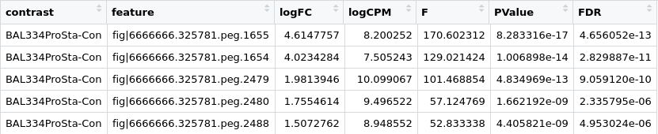
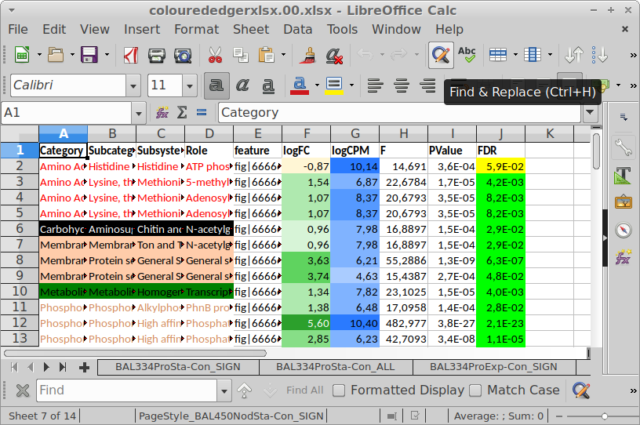

# colourededgerxlsx
Outputs an xlsx file with one tab for each contrast in a table, with 
colours for SEED categories and heatmaps for logFC, logCPM and FDR.

# Overview

The main input for the script is a table with top tags from an 
[EdgeR](https://bioconductor.org/packages/release/bioc/html/edgeR.html) 
analysis. The table should have all columns from an extracted top tags 
table, plus a column called "contrasts".

The input file should look like this:



In the current version -- 0.1 -- given one or more SEED annotation tables
keyed by feature one can produce a spreadsheet with two tabs for each contrast, 
one with all features with `FDR <= 0.10` and one with all:



Colours -- ugly but relatively distinct -- are currently hardcoded in the script.

# Installation

Clone the repository and make sure the `src/R/colourededgerxlsx.r` is in
your path, potentially by symlinking to it. E.g.:

```
$ cd ~/dev
$ git clone https://github.com/erikrikarddaniel/colourededgerxlsx.git
$ cd ~/bin
$ ln -s ../dev/colourededgerxlsx/src/R/colourededgerxlsx.r .
```

# Usage

There's a `--help` flag to the script that explains how to call it. A typical call
looks like this:

```
$ colourededgerxlsx.r --verbose \
  --seedtables=genome1.SEED.tsv,genome2.BAL450.SEED.tsv \
  --outxlsx=coloured_edger.xlsx \
  edger_table.tsv.gz
```

# Future plans

* *Version 0.2*: Add actual counts/cpms for samples from a table.

* *Version 0.3*: Add second functional annotation for genes not in the
SEED table(s).

* *Version 0.4*: Translate sample names with translation table.
